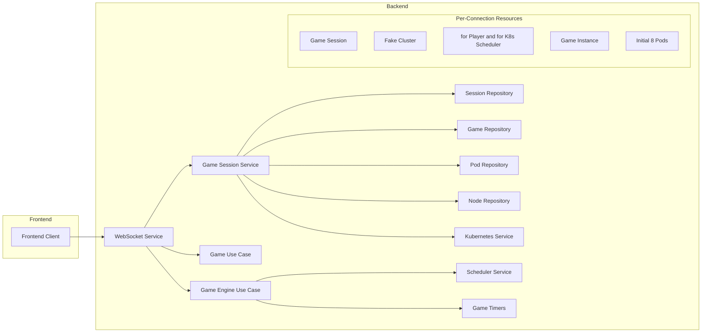
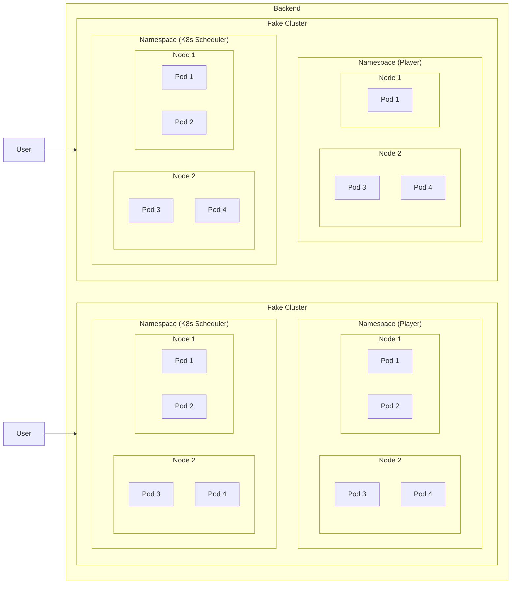
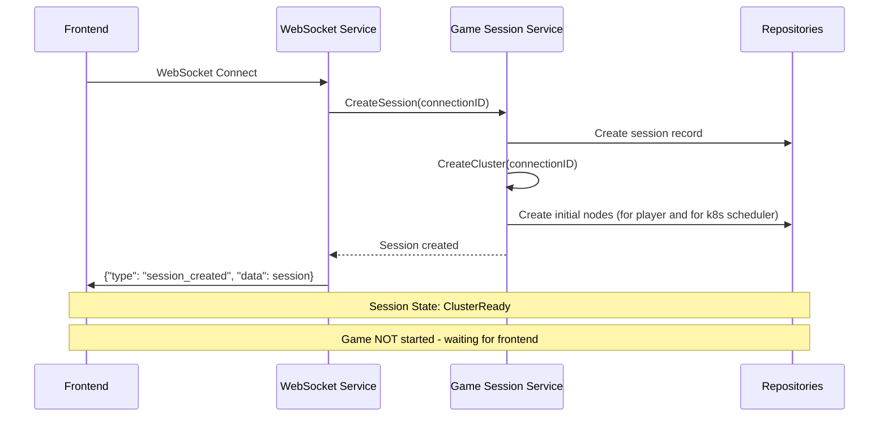
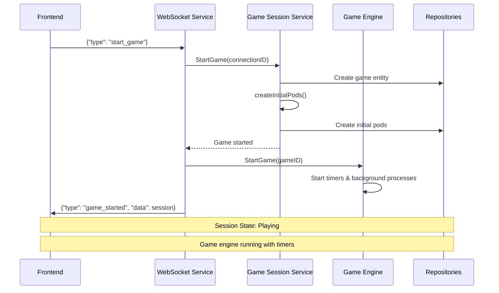
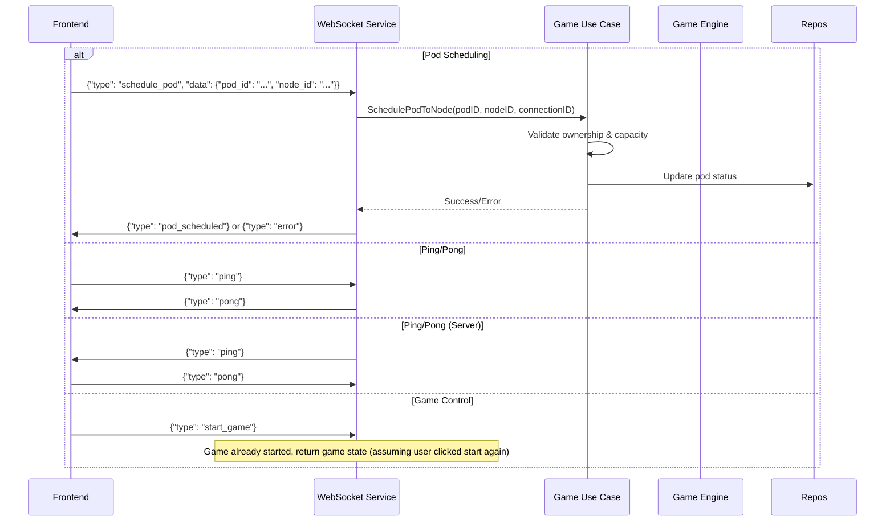
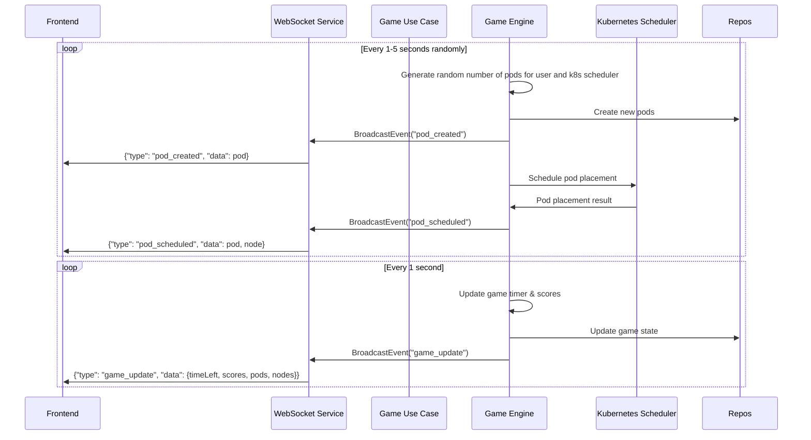
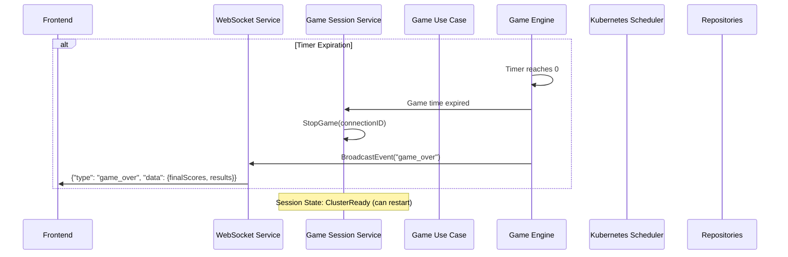
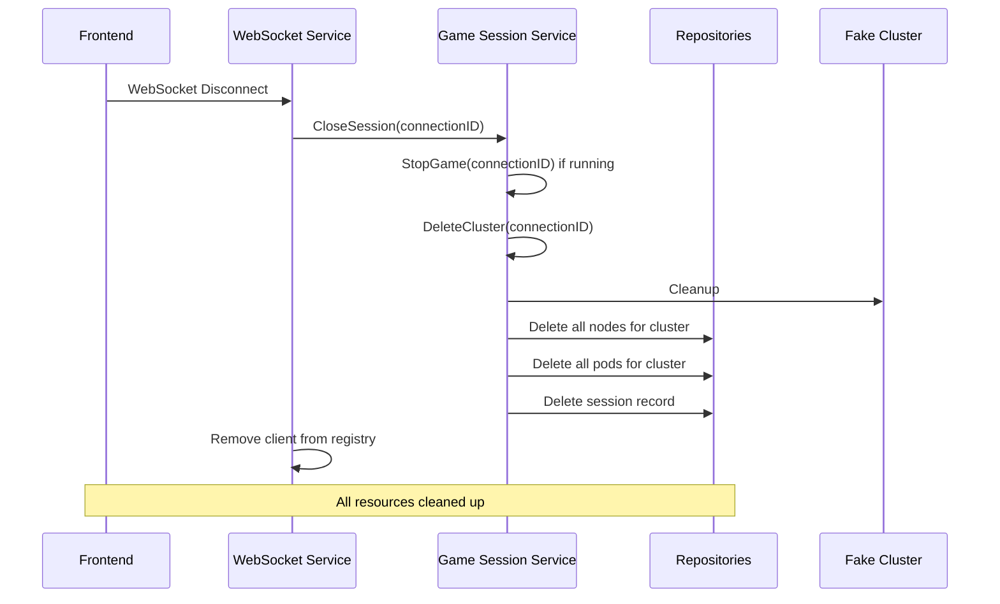

# KubeGame - Message Flow and Game Sequence Documentation

## Overview

This document describes the complete message flow and game sequence for the KubeGame backend WebSocket API, including the connection lifecycle, game phases, and real-time communication patterns.

## Architecture Overview

## Cluster overview

Each WebSocket connection creates a unique cluster. Each cluster has 2 namespaces for the player and for the k8s scheduler. Everytime game engine request pod schedule, send same request to both namespaces because player and k8s scheduler can schedule pods to their own namespaces, and player try to beat k8s scheduler in the same situation.

## Connection-Based Game Lifecycle

### Phase 1: Connection & Session Creation
**Trigger**: Frontend connects to WebSocket `/ws`

### Phase 2: Frontend Game Start
**Trigger**: Frontend sends `start_game` message

### Phase 3: Game Interaction
**Trigger**: Various frontend actions

### Phase 4: Background Game Events
**Trigger**: Automatic timers and game engine

### Phase 5: Game End & Cleanup
**Trigger**: Game timer expires or manual stop

### Phase 6: Connection Cleanup
**Trigger**: Frontend disconnects

## Message Types Reference

### Client-to-Server Messages

| Type | Description | Payload | Response |
|------|-------------|---------|----------|
| `ping` | Heartbeat check | `null` | `pong` event |
| `start_game` | Start new game (if stopped) | `null` | `game_started` or `error` |
| `schedule_pod` | Player schedules pod to node | `{"pod_id": "...", "node_id": "..."}` | `pod_scheduled` or `error` |

### Server-to-Client Events

| Type | Description | Payload | Response |
|------|-------------|----------------|----------|
| `session_ready` | Session info after join | `{"sessionID": "...", "clusterID": "...", "state": "..."}` | No response |
| `game_started` | Game started confirmation | `{"gameID": "...", "timeLeft": 300}` | No response |
| `game_over` | Game ended (timer) | `{"results": {...}, "playerScore": 0, "cpuScore": 0}` | No response |
| `game_update` | Periodic game state | `{"timeLeft": 250, "playerScore": 5, "cpuScore": 3}` | No response |
| `pod_created` | New pod available | `{"id": "...", "name": "...", "requirements": {...}}` | No response |
| `pod_scheduled` | Pod assigned to node | `{"podID": "...", "nodeID": "...", "scheduledBy": "player\|cpu"}` | No response |
| `error` | Error occurred | `{"message": "Error description"}` | No response |
| `ping` | Ping request from server | `null` | `pong` |

## Game Rules & Scoring

### Resource Allocation
- **Player Nodes**: 4 nodes with varying CPU/Memory capacity (players can schedule here)
- **K8s Scheduler Node**: 1 node with high capacity for automatic scheduling
- **Initial Pods**: 8 pods created at game start with random resource requirements

### Scoring System
- **Player Points**: Earned when player successfully schedules pods to player nodes
- **K8s Scheduler Points**: Earned when Kubernetes scheduler assigns pods to the scheduler node
- **Game Duration**: 5 minutes (300 seconds) by default

### Pod Labels & Types
Pods are randomly assigned one of four labels:
- `banana` 🍌
- `chocolate` 🍫  
- `strawberry` 🍓
- `vanilla` 🍦

### Node Types & Constraints
- **Player Nodes**: `worker-01`, `worker-02`, `worker-03`, `worker-04` - user controllable
- **K8s Scheduler Node**: `scheduler-01` - automatic scheduling only

## Session Isolation

Each WebSocket connection gets completely isolated resources:

1. **Unique Session ID**: UUID-based session identifier
2. **Dedicated Cluster**: Cluster name format: `cluster-{connectionID}`
3. **Isolated Nodes**: Node IDs include cluster suffix: `player-node-1-cluster-{connectionID}`
4. **Separate Game State**: Each session has independent game timer, score, and pod set
5. **Independent Lifecycle**: Sessions don't affect each other

## Error Handling

### Common Error Scenarios

| Scenario | Error Message | Recovery |
|----------|---------------|----------|
| Invalid pod scheduling | `"Pod does not exist"` | Check pod ID |
| Node capacity exceeded | `"Insufficient resources on node"` | Try different node |
| Cross-session access | `"Node does not belong to session"` | Use session's own nodes |
| Game not running | `"No active game for session"` | Start game first |
| Cluster not ready | `"Cluster not ready for session"` | Wait for cluster creation |

### WebSocket Error Handling
- Connection errors trigger automatic session cleanup
- Invalid message types log warnings but don't disconnect
- Repository errors are caught and returned as error events

## Performance Characteristics

### Scalability
- **Memory**: ~1MB per active session (nodes + pods + game state)
- **CPU**: Background timers run per game (3 timers × number of active games)
- **Cleanup**: Automatic on disconnect, manual cleanup available

### Real-time Updates
- **Game State**: 1-second intervals
- **Pod Generation**: 2-second intervals  
- **Scheduler Actions**: 3-second intervals
- **Heartbeat**: 30-second ping intervals (frontend-initiated)

## Development Notes

### Testing Strategy
- Integration tests create isolated test environments
- Each test gets fresh dependency injection container
- WebSocket connections tested with `gorilla/websocket` test client
- Session isolation verified through multi-client tests

### Future Extensions
- Game difficulty levels
    - Easy mode: No node creation/destruction
    - Normal mode: User controls only Pod scheduling, automatic node management
    - Hard mode: User can create/destroy nodes
- Team/multiplayer modes
- Ranking system for competitive play
